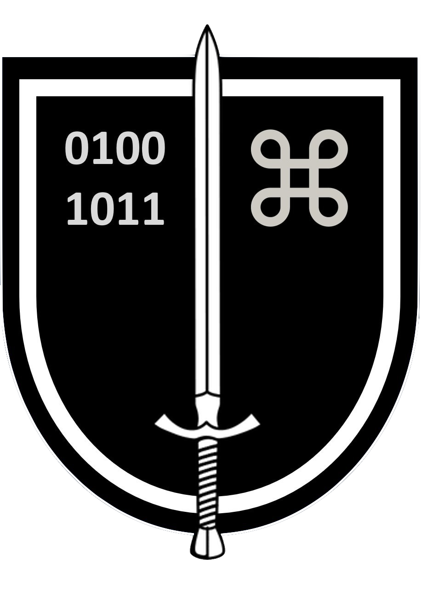

## Tarkoitus
Killan tarkoituksena on edistää maanpuolustustyötä ja kansalaisten maanpuolustustahtoa yhdistämällä kyberpuolustusalalla toimivia ja toimineita henkilöitä. 
Kilta edesauttaa jäseniä verkostoitumaan, kehittää jäsenistönsä ammattitaitoa sekä vaalii kyberpuolustusalan perinteitä sekä ylläpitää ja kehittää kyberpuolustuksen tuntemusta ja tietämystä.

## Jäseneksi
Killan varsinaiseksi jäseneksi voidaan hyväksyä henkilö, joka hyväksyy yhdistyksen tarkoituksen.
Kannattavaksi jäseneksi voidaan hyväksyä yksityinen henkilö tai oikeuskelpoinen yhteisö, joka haluaa tukea yhdistyksen tarkoitusta ja toimintaa.

Varsinaiset jäsenet ja kannattavat jäsenet hyväksyy hakemuksesta yhdistyksen hallitus.

Hakemuksen voi lähettää osoitteeseen: jasenasiat@kyberpuolustuskilta.fi

PJ: Anssi Kärkkäinen 
 
